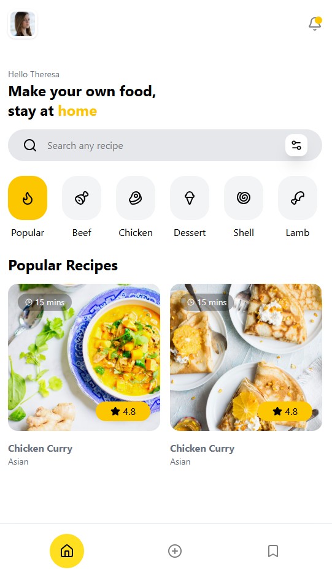

# Meal-UI

Bu proje, **Zafer Ayan hocamız** ile birlikte gerçekleştirilen bir kurs kapsamında geliştirilmiştir.  
Mobil arayüz tasarımı, web ortamında **React, Vite, Tailwind CSS ve TypeScript** kullanılarak kodlanmıştır.  

## Özellikler
- Modern mobil arayüz tasarımı  
- React ile bileşen tabanlı geliştirme  
- Header, Hero, Searchbar, Bottom Navigation gibi temel UI bileşenleri  
- Categories ve Popular Recipes bölümleri  
- TypeScript ile güçlü tip desteği  
- Tailwind CSS ile hızlı ve esnek stil yönetimi  

## Teknolojiler
- [React](https://react.dev/)  
- [Vite](https://vitejs.dev/)  
- [TypeScript](https://www.typescriptlang.org/)  
- [Tailwind CSS](https://tailwindcss.com/)  

## Ekran Görüntüsü



## Kurulum
```bash
# repoyu klonla
git clone https://github.com/gorkemkaragl/meal-ui.git

# dizine gir
cd meal-ui

# bağımlılıkları yükle
npm install

# projeyi çalıştır
npm run dev
