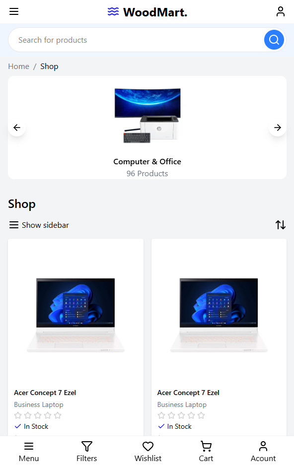

# 🛒 React Shopping Site

Bu proje Zafer Ayan hocamız ile birlikte gerçekleştirilen bir kurs kapsamında geliştirilmiştir.
**React** kullanılarak geliştirilmiş modern bir **alışveriş
sitesi ön yüzü (frontend)** uygulamasıdır.\
Mobil cihazlar için tasarlanmış bir görünüme sahiptir, ancak web
tarayıcılarında da açılabilmektedir.

## 🚀 Özellikler

-   📱 **Mobil odaklı tasarım** (responsive görünüme uygun)\
-   🔎 Ürün arama çubuğu\
-   🛍️ Ürün listeleme (kategoriye göre)\
-   ⭐ Ürün detay kartları (isim, stok bilgisi, değerlendirme alanı)\
-   📂 Sidebar aç/kapa özelliği\
-   🧾 Alt menü (Menu, Filters, Wishlist, Cart, Account)

## 🖼️ Görünüm

Projenin arayüzünden bir örnek:



## 🛠️ Kullanılan Teknolojiler

-   ⚛️ **React**\
-   🎨 **Tailwind CSS** (hızlı ve modern stil yapısı için)\
-   📘 **TypeScript** (tip güvenliği için)\
-   🔍 **ESLint** (kod standartlarını korumak için)

## 📦 Kurulum

Projeyi yerelde çalıştırmak için:

``` bash
# Projeyi klonla
git clone https://github.com/gorkemkaragl/react-shopping-site.git

# Proje klasörüne gir
cd react-shopping-site

# Gerekli paketleri yükle
npm install

# Projeyi çalıştır
npm start
```
